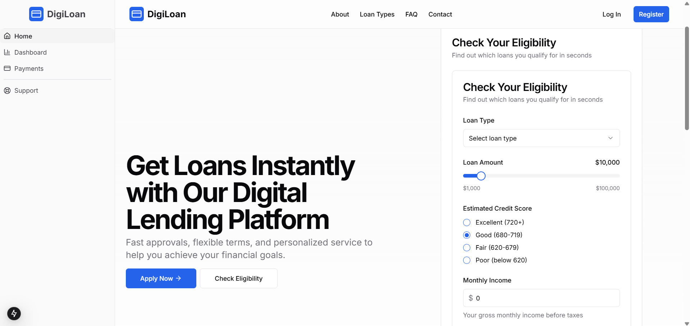
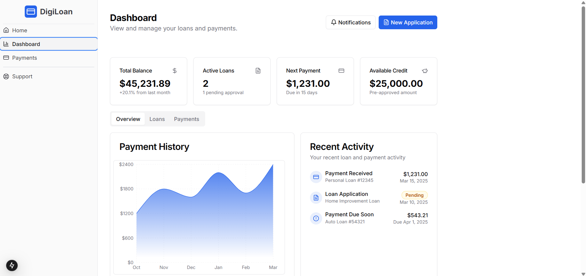

# automated-compliance-management-system

# DigiLoan - Digital Loan Application Platform (Automated Compliance Management System)

DigiLoan is a frontend prototype of digital loan application website built using NextJS for the frontend and a backend that integrates Gemini API to check loan eligibility based on RBI rules. The backend uses MySQL to store loan details.





## Features

- **User Dashboard**: View loan balance, active loans, payments, and available credit.
- **Loan Application**: Users can apply for a loan with a seamless process.
- **Eligibility Checker**: Integrated Gemini API ensures accurate eligibility assessment.
- **Payment History**: Visual representation of past payments.
- **Secure Data Handling**: MySQL database ensures data integrity and security.

## Tech Stack

- **Frontend**: NextJS, Tailwind CSS, TypeScript

## Installation

1. Clone the repository:
   ```sh
   git clone https://github.com/maitreemistry/automated-compliance-management-system
   ```
2. Install dependencies:
   ```sh
   npm install
   ```
3. Start the development server:
   ```sh
   npm run dev
   ```

## Future Work

- Implementing the backend functionality
- Connecting the application to a MySQL database
- Integrating Gemini API for loan eligibility checking

## Contributing

Pull requests are welcome. For major changes, please open an issue first to discuss what you would like to change.

